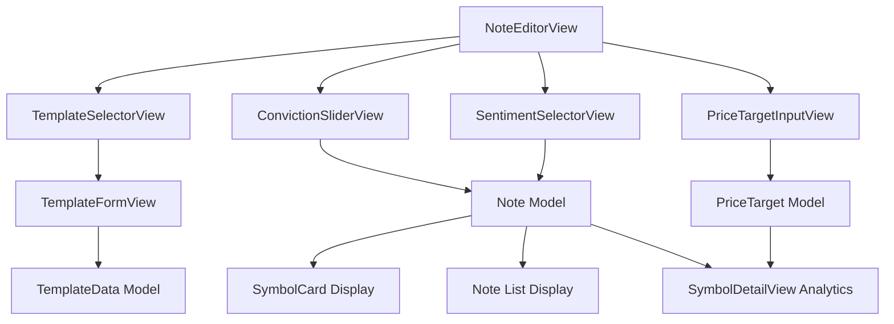

# Thesis Templates, Sentiment Tracking & Price Targets Implementation

## Overview

This plan extends the Stock Notes app with structured templates, conviction/sentiment tracking, and price target analytics. The implementation adds new data models, enhances the note editor, and provides visualization capabilities for tracking investment thesis evolution.

## Architecture Changes

### New Data Models

1. **TemplateData** - Stores structured template responses

   - Template type enum (Entry Thesis, Thesis Update, Exit Decision, Dividend Stock, Technical Analysis)
   - Template-specific fields (stored as JSON or individual properties)
   - Optional relationship to Note

2. **PriceTarget** - Tracks price targets over time

   - Symbol relationship
   - Target price, target date, thesis rationale
   - Created date for tracking
   - Optional relationship to Note (if created from a note)

3. **Note Model Extensions**

   - Add `conviction: Int?` (1-10 scale)
   - Add `sentiment: Sentiment?` enum (bullish, bearish, neutral)

### New Services

1. **TemplateService** - Manages template definitions and data
2. **PriceTargetService** - Manages price targets, comparisons, accuracy calculations
3. **SentimentAnalysisService** - Basic language analysis for sentiment detection

## Implementation Steps

### Step 1: Extend Data Models

**Files to modify:**

- [`stocknotes/Models/Note.swift`](stocknotes/Models/Note.swift) - Add conviction and sentiment fields
- [`stocknotes/Models/AppDataModel.swift`](stocknotes/Models/AppDataModel.swift) - Add new models to schema

**Files to create:**

- `stocknotes/Models/TemplateData.swift` - Template data model
- `stocknotes/Models/PriceTarget.swift` - Price target model
- `stocknotes/Models/TemplateType.swift` - Template type enum and definitions

**Details:**

- Add `conviction: Int?` to Note (1-10 scale)
- Add `sentiment: Sentiment?` enum to Note
- Create TemplateData model with template type and structured fields
- Create PriceTarget model with symbol relationship
- Update schema to include new models

### Step 2: Template System Implementation

**Files to create:**

- `stocknotes/Services/TemplateService.swift` - Template management
- `stocknotes/Views/Components/TemplateSelectorView.swift` - Template selection UI
- `stocknotes/Views/Components/TemplateFormView.swift` - Dynamic form for template fields

**Details:**

- Define 5 template types with their field structures:
  - Entry Thesis: symbol, entryPrice, thesis, catalysts, riskFactors, conviction
  - Thesis Update: previousConviction, newConviction, whatChanged, newPriceTarget
  - Exit Decision: symbol, exitPrice, gainLossPercent, thesisAccuracy, lessonsLearned
  - Dividend Stock: symbol, yield, growthRate, divSafety, rebalanceTrigger
  - Technical Analysis: chartPattern, entrySignal, stopLoss, targetPrice, timeframe
- Create template selection UI in NoteEditorView
- Auto-populate template fields when template is selected
- Store template responses in TemplateData model
- Make template usage optional (users can still freestyle)

### Step 3: Conviction & Sentiment Tracking

**Files to create:**

- `stocknotes/Views/Components/ConvictionSliderView.swift` - Visual slider (1-10)
- `stocknotes/Views/Components/SentimentSelectorView.swift` - Sentiment picker
- `stocknotes/Services/SentimentAnalysisService.swift` - Basic language analysis

**Files to modify:**

- [`stocknotes/Views/NoteEditorView.swift`](stocknotes/Views/NoteEditorView.swift) - Add conviction slider and sentiment selector
- [`stocknotes/Views/Components/SymbolCard.swift`](stocknotes/Components/SymbolCard.swift) - Display conviction indicator with color coding
- [`stocknotes/Views/Components/NotePreviewRow.swift`](stocknotes/Views/Components/RecentNotesList.swift) - Show conviction and sentiment badges
- [`stocknotes/Views/SymbolDetailView.swift`](stocknotes/Views/SymbolDetailView.swift) - Add conviction trend chart

**Details:**

- Add conviction slider (1-10) with color coding:
  - Red: 1-3 (Low conviction)
  - Yellow: 4-7 (Medium conviction)
  - Green: 8-10 (High conviction)
- Add sentiment selector (bullish/bearish/neutral)
- Implement basic sentiment analysis (keyword-based) for auto-suggest
- Display conviction indicator on symbol cards and note lists
- Create conviction trend chart in SymbolDetailView showing conviction over time
- Add visual badges for sentiment on notes

### Step 4: Price Target Tracking

**Files to create:**

- `stocknotes/Services/PriceTargetService.swift` - Price target management
- `stocknotes/Views/Components/PriceTargetInputView.swift` - Price target entry form
- `stocknotes/Views/PriceTargetsView.swift` - Dedicated price targets view
- `stocknotes/Views/Components/PriceTargetCard.swift` - Price target display card

**Files to modify:**

- [`stocknotes/Views/NoteEditorView.swift`](stocknotes/Views/NoteEditorView.swift) - Add optional price target input
- [`stocknotes/Views/SymbolDetailView.swift`](stocknotes/Views/SymbolDetailView.swift) - Show price targets section
- [`stocknotes/Services/YahooFinanceService.swift`](stocknotes/Services/YahooFinanceService.swift) - Ensure price fetching works for comparisons

**Details:**

- Create PriceTarget model with symbol, targetPrice, targetDate, thesisRationale
- Add price target input in note editor (optional field)
- Create dedicated price targets view showing all targets for a symbol
- Implement comparison logic: actual price vs target price
- Calculate and display accuracy percentage
- Show status: met, missed, exceeded, pending
- Display price targets in SymbolDetailView

### Step 5: Analytics & Visualization

**Files to create:**

- `stocknotes/Views/Components/ConvictionChartView.swift` - Chart showing conviction over time
- `stocknotes/Views/Components/PriceTargetComparisonView.swift` - Visual comparison of targets vs actual

**Files to modify:**

- [`stocknotes/Views/SymbolDetailView.swift`](stocknotes/Views/SymbolDetailView.swift) - Add analytics section

**Details:**

- Create conviction trend chart using Swift Charts
- Show price target accuracy metrics
- Display target vs actual price comparison chart
- Add analytics section to SymbolDetailView

## Data Flow

## UI Enhancements

### Note Editor Enhancements

- Template selector dropdown/picker at top of editor
- When template selected, show template-specific form fields
- Conviction slider with color-coded segments
- Sentiment selector (segmented control or picker)
- Optional "Add Price Target" section

### Symbol Card & Note List

- Conviction indicator badge (colored circle or bar)
- Sentiment badge (bullish/bearish/neutral icon)
- Visual hierarchy: High conviction notes stand out

### Symbol Detail View

- Conviction trend chart (line chart over time)
- Price targets section with comparison cards
- Accuracy metrics display

## Technical Considerations

### Template Storage

- Store template responses as structured data in TemplateData
- Use Codable for flexible field storage (can store as JSON)
- Maintain backward compatibility with existing notes

### Sentiment Analysis

- Start with keyword-based analysis (simple but effective)
- Keywords: "bullish", "bearish", "buy", "sell", "positive", "negative", etc.
- User can override auto-detected sentiment
- Future: Could integrate ML model for better accuracy

### Price Target Accuracy

- Calculate accuracy when target date is reached or exceeded
- Compare current price vs target price
- Display percentage difference
- Track historical accuracy for analytics

### Charts

- Use Swift Charts framework (native iOS 16+)
- Fallback to simple bar/line views for older iOS versions if needed
- Cache chart data for performance

## Migration Strategy

- All new fields are optional, ensuring backward compatibility
- Existing notes will have nil conviction/sentiment (gracefully handled)
- Template usage is optional - existing workflow unchanged
- Price targets are additive - doesn't affect existing notes

## Testing Considerations

- Test template selection and form population
- Test conviction slider and color coding
- Test sentiment auto-detection accuracy
- Test price target creation and comparison logic
- Test conviction trend chart with various data scenarios
- Verify backward compatibility with existing notes